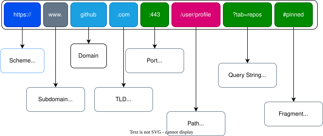

# HTTP in detail

HTTP is a protocol or set of rules used for communicating with web browsers for the transmitting of webpage data, whether that is HTML, Images, Videos, etc... HTTPS is the secure version of HTTP. HTTPS data is encrypted so it not only stops people from seeing the data you are recieving and sending, but it also gives you assurances that we are communicating to the web server and not any impersonating medium.

## What is a URL?
**URL** stands for **Uniform Resource Locator**. It's simply the address of something on the internet. Every single things online (a page, an image, an API endpoint, a file) has a URL. Lets break down the structure of the URL:

 

<table>
  <tr>
    <th>Part</th>
    <th>Example</th>
    <th>What it means</th>
  </tr>
  <tr>
    <td>Scheme</td>
    <td>https:// or http://</td>
    <td>How to communicate - encrypted or not.</td>
  </tr>
</table>
